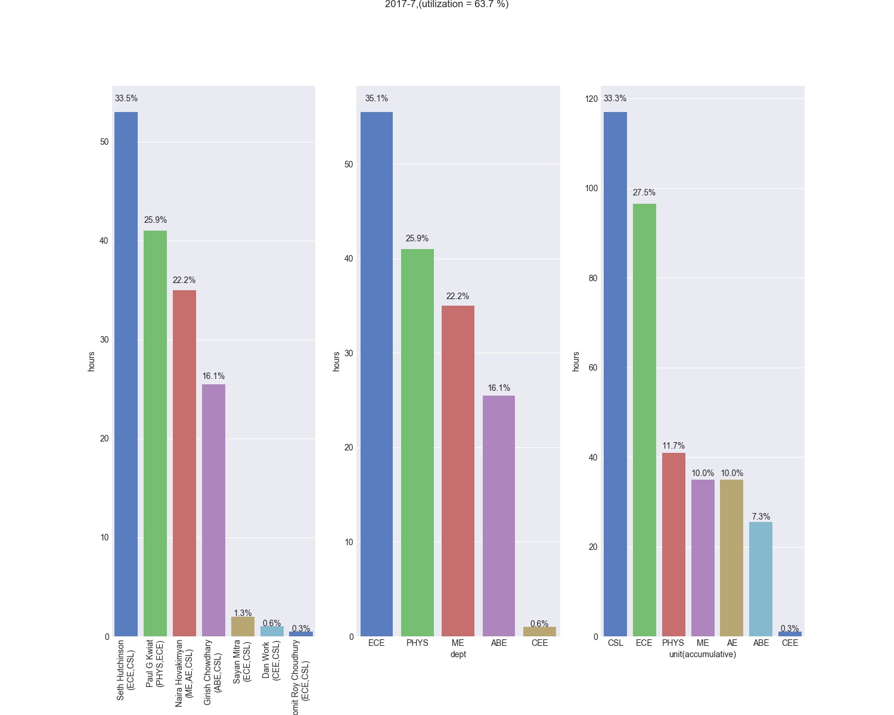
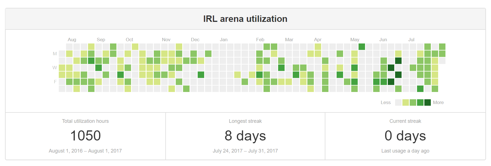

# IRL Lab Utilization

IRL's lab schedule is managed by a google calendar. This project uses Google API (Python3) to generate report for IRL lab activities.

## Functionalities

Examples:
* `report_month()` generates monthly report excel files and a figure summary. e.g.:
```python
report_month(2017,7)
```


* `report_range()` generate report files for a time range. e.g.:
```python
report_range(2017,1,1,2017,8,1)
```


This module also provides API to query user information. e.g.:
```python
PI_dict['Seth Hutchinson'].dept
```
gives `['ECE', 'CSL']`, which are Seth's affiliations

The `get_days_record()` function generates a record file that can be processed by [contribution-graph](https://github.com/alexwlchan/contributions-graph) to generate the following activity html chart:


